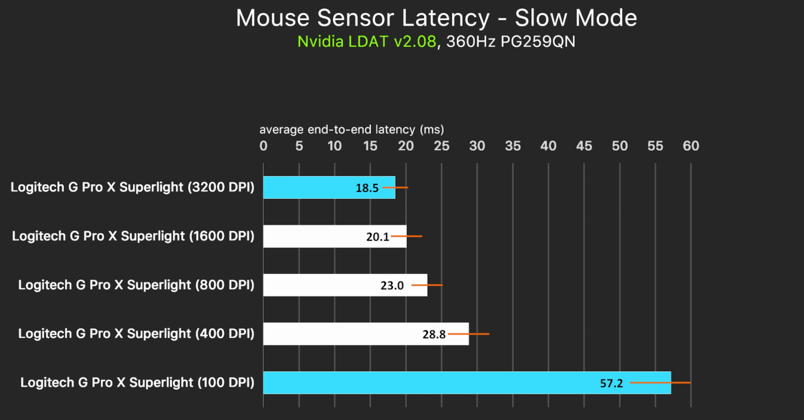

# The Mouse DPI Sweet Spot Is 500

The theory started simply: DPI is not just “sensitivity.” DPI is a sampling grid. It decides how much physical hand motion is required before the mouse reports anything at all.

That sounds obvious once said out loud. But it changes the question.

Most people ask: “What DPI is fastest?”

The better question is: **what DPI is high enough to preserve fine control, but low enough to stop your nervous system from leaking into your aim?**

## Step 1: DPI is a distance threshold

DPI means counts per inch. So the physical distance needed to generate one count is:

$$
d = \frac{25.4\text{ mm}}{\text{DPI}}
$$

That gives:

| DPI | Distance per count |
|---:|---:|
| 400 | 0.0635 mm |
| 450 | 0.0564 mm |
| 500 | 0.0508 mm |
| 550 | 0.0462 mm |
| 800 | 0.0318 mm |
| 1600 | 0.0159 mm |

At **400 DPI**, your mouse can move about **63.5 micrometers** before the sensor reports one count. That is a real dead zone. Tiny motions can happen physically without becoming input.

At **800 DPI**, the dead zone halves. More of your hand becomes visible to the machine.

That is the entire argument in miniature: lower DPI does not merely make aim “slower.” It **quantizes** your hand. It refuses to report the smallest motions.

## Step 2: hand shake is not imaginary

Everyone has physiological tremor. Not pathology. Normal human motor noise. It gets worse with adrenaline, caffeine, fatigue, clutch pressure, cold hands, and overgripping.

A reasonable working range for fingertip/grip micro-tremor is roughly **0.05–0.3 mm**, depending on the person and the moment. The low end is calm aim. The high end is “why is my crosshair auditioning for a seizure?”

Counts produced by tremor are approximately:

$$
\text{counts} = \text{tremor amplitude} \times \text{DPI}
$$

If your calm tremor amplitude is around **0.05 mm**, then:

- **400 DPI** → about **1.0 count**
- **450 DPI** → about **1.1 counts**
- **500 DPI** → about **1.3 counts**
- **550 DPI** → about **1.4 counts**
- **800 DPI** → about **2.0 counts**

If your tremor spikes to **0.1 mm** under pressure:

- **400 DPI** → about **1.6 counts**
- **500 DPI** → about **2.5 counts**
- **800 DPI** → about **3.2 counts**

That matched the lived experience immediately: **800 felt shaky because 800 is high enough for tremor to become a readable signal.** At 400, more of that noise gets swallowed by quantization before it becomes crosshair movement.

## Step 3: the suspicious part

Here is the part that made the theory feel less like a vibe and more like a trapdoor.

Solve for the DPI where a given tremor amplitude crosses roughly one count:

$$
\text{DPI}_{\text{tremor}} \approx \frac{25.4}{\text{tremor amplitude in mm}}
$$

For a **0.06 mm** micro-tremor:

$$
25.4 / 0.06 \approx 423\text{ DPI}
$$

For a **0.05 mm** micro-tremor:

$$
25.4 / 0.05 \approx 508\text{ DPI}
$$

That bracket — **~423 to ~508 DPI** — is uncomfortably close to the proposed **450–500** band.

That was the moment the theory stopped sounding like numerology. We did not pick 450–550 first and reverse-engineer a justification. The tremor math independently landed on almost the same neighborhood. **Suspiciously close.** Close enough that the sweet spot hypothesis deserved to be treated as a real model, not preference folklore.

## Step 4: latency pulls the other way

If tremor filtering were the only variable, everyone should play at the lowest DPI possible. But the latency data says no.

The chart shows the expected pattern: extremely low DPI is bad. At **100 DPI**, end-to-end latency is enormous. At **400 DPI**, latency is still clearly worse than the higher-DPI entries. From **800 to 3200 DPI**, latency improves.

A reasonable fitted curve for the usable 400–1600 region is approximately:

$$
L \approx 17.2 + \frac{4640}{\text{DPI}}\text{ ms}
$$

Estimated from that model:

| DPI | Estimated latency |
|---:|---:|
| 400 | ~28.8 ms |
| 450 | ~27.5 ms |
| 500 | ~26.5 ms |
| 550 | ~25.6 ms |
| 800 | ~23.0 ms |
| 1600 | ~20.1 ms |

So there is a real cost to staying too low. **400 DPI buys stability by paying latency.** **800 DPI buys responsiveness by exposing tremor.** The sweet spot is not the lowest latency or the lowest noise. It is the point where the sum of both errors is minimized.

That point is around **500**.

## Step 5: why so many Counter-Strike pros still use 400

The lazy explanation is muscle memory. It is not wrong, but it is incomplete.

A lot of CS players came up when 400 DPI was the default competitive language: old sensors, old LAN habits, old config culture, old aim maps. That matters. But there is also science underneath the tradition.

**400 DPI works because it is a human low-pass filter.**

It gives you:

- a larger physical dead zone before input registers,
- fewer tremor counts leaking into micro-adjustments,
- a calmer visual feedback loop,
- less “I saw my own shake and made it worse” spiraling,
- and more forgiveness during high-pressure holds.

That last point is underrated. Aim is not only sensor-to-screen. It is sensor-to-screen-to-eyes-to-brain-to-hand. If the screen shows every tiny hand error, some players tense up, grip harder, and produce more tremor. Higher DPI can create a feedback amplifier for anxious aim. Lower DPI can damp that loop.

So no, **400 > 800** is not objectively true for latency. It is often true for **human stability**. The machine prefers 800. The hand often prefers 400.

The interesting zone is where both stop complaining.

## Step 6: why 800 became popular anyway

800 DPI has a real argument: lower latency, finer granularity, less pixel-stepping on high-resolution displays, and smoother micro-corrections if your hands are steady.

For players with calm hands, strong motor control, low caffeine, good sleep, and a relaxed grip, 800 can feel clean. It reveals more of the hand, but if there is less noise to reveal, that is fine.

This is why the debate never dies. People are not measuring the same nervous system.

A steady-handed aimer experiences 800 DPI as precision. A shakier aimer experiences 800 DPI as surveillance.

## The verdict

**500 DPI is the sweet spot.**

Not because it is magical, but because it sits at the collision point of three curves:

1. **Tremor leakage** rises as DPI increases.
2. **Latency** improves as DPI increases.
3. **Control granularity** improves as DPI increases, but only until your own noise becomes the limiting factor.

At **500 DPI**, one count is about **0.0508 mm**. That is small enough for deliberate micro-adjustments to register cleanly, but still large enough that calm physiological tremor is only barely crossing the threshold. It claws back meaningful latency from 400 without fully opening the tremor floodgates at 800.

The practical range is **450–550**:

- Use **450 DPI** if your hands are naturally shakier, you play tense clutch-heavy games, you grip hard under pressure, or you value stability over raw response.
- Use **500 DPI** if you want the balanced answer and do not want to think about it ever again.
- Use **550 DPI** if your hands are steady, your setup is high-resolution, and you want slightly finer granularity without jumping to the tremor exposure of 800.

Below that range, latency and quantization start taxing you. Above it, your nervous system starts appearing on screen.

The mouse is not just reporting movement. It is deciding which parts of you count as movement.

500 DPI is where the machine hears your intention more clearly than your pulse.

---

*Apophenia News — finding patterns in the noise since 2026*

*Aim is signal. Hands are noise. DPI is the filter.*
